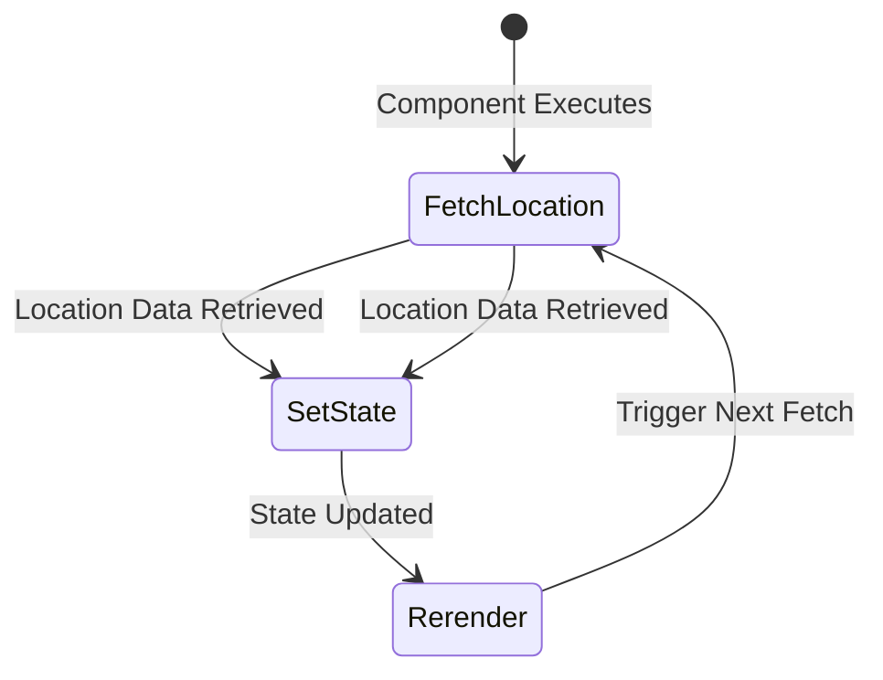

# Exploring `useEffect()` Hook and Side Effects Management 

## Topics - Keeping UI Synchronized
1. Side Effects 
2. `useEffect()` hook
3. Effects & Dependencies 
4. When to not use `useEffect()` hook

---

## Getting Started 
- Download local starting project 
- `npm install` 
- `npm run dev` 

---

## Local Starting Project 
- Couple components 
- Utilizes State, Refs and `useImperativeHandle()`
- `data.js` - random data for outputting the place cards 
- `loc.js` - location calculation logic

---

## Heads Up
`loc.js` has a function where we will begin exploring the new concepts: 
```js
sortPlacesByDistance
```

---

### What are Side Effects? 🤔
- Tasks that need to be executed but don't impact the current render cycle 
- Something needs to be done that should not directly or instantly impact the current render cycle

---

## Example 
- In the current app, we have a list of places we'd like to sort by distance to the website user 
- We have a `loc` file to calculate that distance 
- We export `sortPlacesByDistance`, a function that takes an array of places and sorts it:
    - Relative to the user's location 

### Problem #1: User Location
We need the user's location. 
- In theory, that's not difficult. We can use a built-in browser feature 
- We need this ASAP to start running algorithms 
- `App.jsx` is our "entry point" aka the root component 
- Makes sense to derive the user location here 

Method: `navigator.geolocation.getCurrentPosition()`
- Asks the user for permission before retrieving location 
- Takes time to fetch the location 
- Provides a callback function 
- Runs once location has been fetched (milliseconds or seconds)

```jsx
navigator.geolocation.getCurrentPosition(()=>{

})
```

Calling `sortPlacesByDistance`:
- Pass `AVAILABLE_PLACES`
- Need longitude and latitude coordinates 
- Browser provides via position object in callback 
- Access nested `coords` object for `latitude` and `longitude`
- Returns sorted array based on location

```jsx
navigator.geolocation.getCurrentPosition((position)=>{
    const sortedPlaces = sortPlacesByDistance(
        AVAILABLE_PLACES,
        position.coords.latitude, 
        position.coords.longitude
    )
})
```

### Problem #2 - Side Effect 
We need the location BUT:
- Not directly related to the Component's main objective 
- App's main goal is to return renderable JSX code 
- Unrelated to UI renders 
- Similar to event listeners, setting state 
- Location fetching doesn't finish instantly 

### That's Why It's a Side Effect!
- Not necessarily bad 
- Problem: `sortedPlaces` isn't available right away 
- First render cycle of `App` finishes before user location is retrieved

---

## Solution: Using State
```jsx
const [availablePlaces, setAvailablePlaces] = useState([]);
navigator.geolocation.getCurrentPosition((position)=>{
    const sortedPlaces = sortPlacesByDistance(
        AVAILABLE_PLACES,
        position.coords.latitude, 
        position.coords.longitude
    )
    setAvailablePlaces(sortedPlaces);
});
```

### Beware: Potential Infinite Loop 
- Updating state tells React to re-execute the component 
- Component function executes again 
- Fetches user's location again 
- Sets state again 

### Visualizing the Loop with Mermaid




Circular loop:
- Component Executes
- Fetch Location
- Set State
- Re-render
- Fetch Location
- Set State

---

### Summary: The Problem
- `App renders` → No user location yet
- `getCurrentPosition()` → Time-consuming (user permission + GPS data)
- `React doesn't wait!` → Completes rendering without location
- `UI built with incomplete data` → `sortPlacesByDistance()` needs location
- `Location arrives` → But React doesn't know to update UI

### Why is This a Problem?
- React doesn't track local variables like `sortedPlaces`
- Location arrives, but React won't re-render to show sorted list

### How to Fix
✅ Use `useState()` → Store `sortedPlaces` in state for React to track changes
✅ Use `useEffect()` → Run `getCurrentPosition()` after first render
✅ Update state when location arrives → React sees change, triggers re-render
