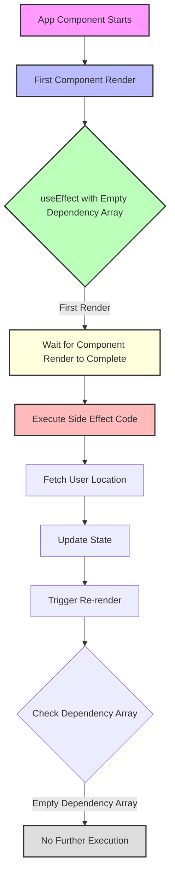

# React `useEffect()` Deep Dive

## Core Concept
`useEffect()` is a React Hook for managing side effects in functional components, handling operations that shouldn't directly impact the rendering cycle.

## Import and Basic Structure
```jsx
import { useEffect } from 'react';
```

### Key Characteristics
- Executed inside component function
- Does not return a value
- Requires two arguments:
  1. Side effect function
  2. Dependency array

## Solving the Infinite Loop Problem

### Example Code
```jsx
useEffect(() => {
  navigator.geolocation.getCurrentPosition((position) => {
    const sortedPlaces = sortPlacesByDistance(
      AVAILABLE_PLACES,
      position.coords.latitude,
      position.coords.longitude
    );
    setAvailablePlaces(sortedPlaces);
  });
}, []); // Empty dependency array
```

### Execution Mechanics
- Runs AFTER component render
- Waits for component execution to complete
- Prevents immediate re-rendering
- Controls effect execution through dependency array

### Dependency Array Behavior
- `[]` ensures single execution
- Prevents unnecessary re-renders
- Breaks potential infinite loop
- Only runs once after initial component render

## Best Practices
- Use empty `[]` for one-time effects
- Add dependencies when effect relies on specific values
- Avoid omitting dependency array to prevent unintended loops

## Optional Fallback
```jsx
fallbackText="Sorting places by distance..."
```

---

## Key Takeaways
- Manages side effects cleanly
- Provides fine-grained control over effect execution
- Separates rendering logic from additional operations